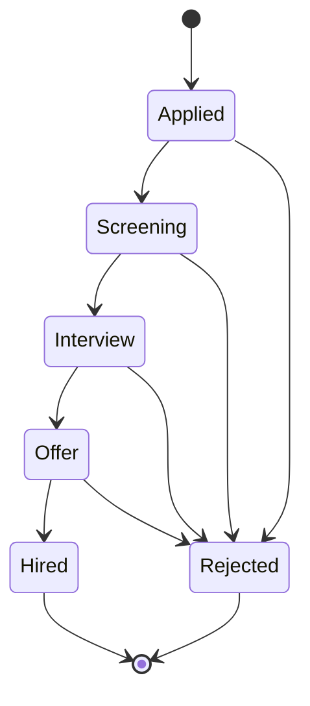

# Job Application Tracking System (ATS) – Backend

A robust backend system for managing job applications with complex state transitions, role-based access control (RBAC), and asynchronous email notifications using Redis + BullMQ.

This project demonstrates:

- Finite State Machine (FSM) for hiring workflows  
- Transaction-safe database operations  
- Decoupled background worker architecture  
- Modular, scalable backend design  

---

## 🏗 Architecture

The system follows a clean Layered Architecture:

1. **API Layer (Express.js)**  
   Handles routing, validation, authentication, rate-limiting.

2. **Service Layer**  
   Business logic + State Machine enforcing valid transitions.

3. **Database Layer (Sequelize + PostgreSQL)**  
   Transaction-safe updates. Audit logs and status updates happen atomically.

4. **Worker Layer (BullMQ + Redis)**  
   Background jobs for sending email notifications asynchronously.

---

## 🔄 Application Workflow (Finite State Machine)

Valid flow:

`Applied → Screening → Interview → Offer → Hired`  
(Reject allowed from any stage)


📊 Database Schema (ERD)
erDiagram
    User ||--o{ Job : "Recruiter posts"
    User ||--o{ Application : "Candidate applies"
    Job ||--o{ Application : "Has"
    Application ||--o{ ApplicationHistory : "Logs changes"

    User {
        int id
        string email
        string role
        string password_hash
    }

    Job {
        int id
        string title
        string status
        int recruiterId
    }

    Application {
        int id
        string status
        int candidateId
        int jobId
    }

    ApplicationHistory {
        int id
        string old_status
        string new_status
        int changedById
    }
---

**🔐 Role-Based Access Control (RBAC)**

| Feature       | Endpoint                   | Method | Candidate | Recruiter | Description              |
| ------------- | -------------------------- | ------ | --------- | --------- | ------------------------ |
| Register      | `/auth/register`           | POST   | ✅         | ✅         | Create new user          |
| Login         | `/auth/login`              | POST   | ✅         | ✅         | Generate JWT             |
| Post Job      | `/jobs`                    | POST   | ❌         | ✅         | Recruiter creates job    |
| Apply         | `/jobs/:id/apply`          | POST   | ✅         | ❌         | Candidate applies        |
| Update Status | `/applications/:id/status` | PATCH  | ❌         | ✅         | Update application stage |

---

**🚀 Setup & Run Instructions**

**1. Prerequisites**
Node.js (v16 or higher)
Docker Desktop (for running PostgreSQL and Redis easily)

2. Installation
```Bash

# Clone the repository
git clone <your-repo-link-here>
cd ats-backend
```
---
# Install dependencies

3. Start Infrastructure (Database & Queue)
This project uses Docker Compose to spin up the required services.

```Bash
npm install
docker-compose up -d
```
This starts a PostgreSQL container on port 5432 and a Redis container on port 6379.

4. Run the Application
Start the API Server and the Background Worker.

```Bash

npx ts-node src/server.ts
```
You should see ✅ Database Ready and 👷 Background Worker Started... in the console.

---
## 🧪 Testing the API
**Option A: Using the Seed Script**

You can quickly populate the database with dummy data (Recruiter, Job, Candidate) by running:

```Bash

# Creates a Recruiter, a Job, and a Candidate Application automatically
curl -X POST http://localhost:3000/seed
```
**Option B: Manual Flow (via Postman or Terminal)**

Register Recruiter: POST /auth/register (Role: recruiter)

Login Recruiter: POST /auth/login → Copy Token.

Post Job: POST /jobs (Use Recruiter Token).

Register Candidate: POST /auth/register (Role: candidate).

Login Candidate: POST /auth/login → Copy Token.

Apply: POST /jobs/1/apply (Use Candidate Token).

Check Logs: You will see the Email Worker process the notification in the terminal.

---

## 🛡 Security Features ##

- Password Hashing: Uses bcrypt to hash passwords before storing them.

- JWT Authentication: Stateless authentication using JSON Web Tokens.

- Input Validation: Strict typing with TypeScript interfaces.

- Transaction Safety: Database updates and Audit Logs either both succeed or both fail.
