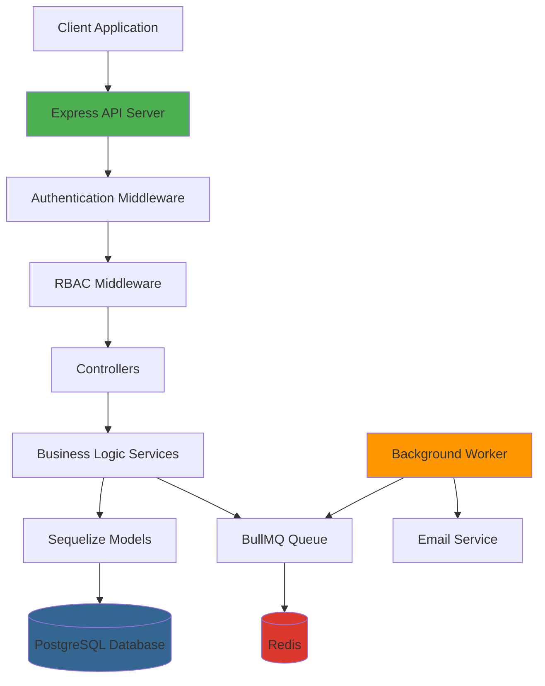
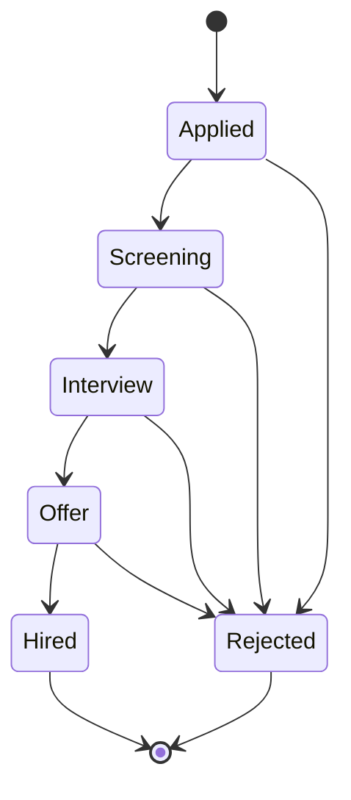

# Job Application Tracking System (ATS) - Backend API

A robust, production-ready backend system for managing job applications with workflow management, role-based access control, and asynchronous email notifications.

[](https://nodejs.org/)
[](https://www.typescriptlang.org/)
[](https://www.postgresql.org/)
[](https://redis.io/)

## 📋 Table of Contents

- [Features](#features)
- [Architecture](#architecture)
- [Tech Stack](#tech-stack)
- [Getting Started](#getting-started)
- [API Documentation](#api-documentation)
- [Testing](#testing)
- [Deployment](#deployment)
- [Project Structure](#project-structure)

## ✨ Features

### Core Functionality
- **User Management**: Support for candidates, recruiters, and hiring managers
- **Job Management**: Full CRUD operations for job postings
- **Application Workflow**: State machine-based application status management
- **Email Notifications**: Asynchronous email notifications for key events
- **Multi-tenancy**: Company-based data isolation

### Technical Features
- **Role-Based Access Control (RBAC)**: Granular permissions for different user roles
- **State Machine**: Enforced workflow transitions for application statuses
- **Background Jobs**: BullMQ for reliable async task processing
- **Request Validation**: Comprehensive input validation using express-validator
- **Error Handling**: Centralized error handling with custom error classes
- **API Versioning**: Versioned API endpoints (v1)
- **Pagination**: Efficient data pagination for list endpoints
- **Health Checks**: Built-in health check endpoint

## 🏗️ Architecture


```mermaid
graph TB
    Client[Client Application] --> API[Express API Server]
    API --> Auth[Authentication Middleware]
    Auth --> RBAC[RBAC Middleware]
    RBAC --> Controllers[Controllers]
    Controllers --> Services[Business Logic Services]
    Services --> Models[Sequelize Models]
    Models --> DB[(PostgreSQL Database)]
    Services --> Queue[BullMQ Queue]
    Queue --> Redis[(Redis)]
    Worker[Background Worker] --> Queue
    Worker --> Email[Email Service]
    
    style API fill:#4CAF50
    style DB fill:#336791
    style Redis fill:#DC382D
    style Worker fill:#FF9800
```

### Application Workflow State Machine


```mermaid
stateDiagram-v2
    [*] --> Applied
    Applied --> Screening
    Applied --> Rejected
    Screening --> Interview
    Screening --> Rejected
    Interview --> Offer
    Interview --> Rejected
    Offer --> Hired
    Offer --> Rejected
    Hired --> [*]
    Rejected --> [*]
```

## 🛠️ Tech Stack

- **Runtime**: Node.js 18+
- **Language**: TypeScript 5.9
- **Framework**: Express.js 5
- **Database**: PostgreSQL 15
- **ORM**: Sequelize 6
- **Cache/Queue**: Redis 7 + BullMQ
- **Authentication**: JWT (jsonwebtoken)
- **Validation**: express-validator
- **Testing**: Jest + Supertest
- **Containerization**: Docker + Docker Compose

## 🚀 Getting Started

### Prerequisites

- Node.js 18 or higher
- Docker Desktop (running)
- npm or yarn

### Installation

1. **Clone the repository**
   ```bash
   git clone <your-repo-url>
   cd ats-backend
   ```

2. **Install dependencies**
   ```bash
   npm install
   ```

3. **Set up environment variables**
   ```bash
   cp .env.example .env
   ```
   
   Edit `.env` and configure your environment variables:
   ```env
   # Database
   DB_HOST=localhost
   DB_PORT=5432
   DB_NAME=ats_db
   DB_USER=user
   DB_PASSWORD=password

   # Redis
   REDIS_HOST=localhost
   REDIS_PORT=6379

   # JWT
   JWT_SECRET=your-super-secret-jwt-key-change-this-in-production
   JWT_EXPIRES_IN=1h

   # Server
   PORT=3000
   NODE_ENV=development
   ```

4. **Start infrastructure services (PostgreSQL + Redis)**
   ```bash
   docker-compose up -d
   ```

5. **Run the application**
   ```bash
   npm run dev
   ```

The API will be available at `http://localhost:3000`

### Verify Installation

Check the health endpoint:
```bash
curl http://localhost:3000/health
```

Expected response:
```json
{
  "success": true,
  "message": "ATS Backend API is running",
  "timestamp": "2026-01-15T08:57:08.000Z",
  "environment": "development"
}
```

## 📚 API Documentation

### Base URL
```
http://localhost:3000/api/v1
```

### Authentication

All protected endpoints require a JWT token in the Authorization header:
```
Authorization: Bearer <your-jwt-token>
```

### Endpoints Overview

#### Authentication
- `POST /api/v1/auth/register` - Register a new user
- `POST /api/v1/auth/login` - Login and receive JWT token

#### Jobs
- `POST /api/v1/jobs` - Create a job (Recruiter only)
- `GET /api/v1/jobs` - List all jobs (with pagination)
- `GET /api/v1/jobs/:id` - Get single job
- `PUT /api/v1/jobs/:id` - Update job (Recruiter only - own jobs)
- `DELETE /api/v1/jobs/:id` - Delete job (Recruiter only - own jobs)

#### Applications
- `POST /api/v1/jobs/:id/apply` - Apply to a job (Candidate only)
- `GET /api/v1/applications/:id` - Get application details (with RBAC)
- `GET /api/v1/applications/me` - Get candidate's own applications
- `GET /api/v1/jobs/:id/applications` - List applications for a job (Recruiter/HM)
- `PATCH /api/v1/applications/:id/status` - Change application status (Recruiter only)

### Example Requests

#### Register a Candidate
```bash
curl -X POST http://localhost:3000/api/v1/auth/register \
  -H "Content-Type: application/json" \
  -d '{
    "name": "John Doe",
    "email": "john@example.com",
    "password": "password123",
    "role": "candidate"
  }'
```

#### Login
```bash
curl -X POST http://localhost:3000/api/v1/auth/login \
  -H "Content-Type: application/json" \
  -d '{
    "email": "john@example.com",
    "password": "password123"
  }'
```

#### Create a Job (Recruiter)
```bash
curl -X POST http://localhost:3000/api/v1/jobs \
  -H "Content-Type: application/json" \
  -H "Authorization: Bearer <recruiter-token>" \
  -d '{
    "title": "Senior Software Engineer",
    "description": "We are looking for an experienced software engineer...",
    "companyId": 1
  }'
```

#### Apply to a Job (Candidate)
```bash
curl -X POST http://localhost:3000/api/v1/jobs/1/apply \
  -H "Authorization: Bearer <candidate-token>"
```

#### Change Application Status (Recruiter)
```bash
curl -X PATCH http://localhost:3000/api/v1/applications/1/status \
  -H "Content-Type: application/json" \
  -H "Authorization: Bearer <recruiter-token>" \
  -d '{
    "status": "interview"
  }'
```

### Response Format

All API responses follow this structure:

**Success Response:**
```json
{
  "success": true,
  "data": { ... },
  "message": "Optional success message"
}
```

**Error Response:**
```json
{
  "success": false,
  "error": "Error message"
}
```

**Paginated Response:**
```json
{
  "success": true,
  "data": [ ... ],
  "pagination": {
    "page": 1,
    "limit": 10,
    "total": 50,
    "totalPages": 5
  }
}
```

## 🧪 Testing

### Run All Tests
```bash
npm test
```

### Run Tests with Coverage
```bash
npm run test:coverage
```

### Run Integration Tests Only
```bash
npm run test:integration
```

### Run Tests in Watch Mode
```bash
npm run test:watch
```

### Test Coverage Goals
- **Branches**: 70%+
- **Functions**: 70%+
- **Lines**: 70%+
- **Statements**: 70%+

## 🚢 Deployment

### Build for Production
```bash
npm run build
```

### Run Production Build
```bash
npm start
```

### Docker Deployment

1. **Build the Docker image**
   ```bash
   docker build -t ats-backend:latest .
   ```

2. **Run with Docker Compose** (uncomment app service in docker-compose.yml)
   ```bash
   docker-compose up -d
   ```

### Environment Variables for Production

Ensure these are set in production:
- `NODE_ENV=production`
- `JWT_SECRET` - Strong, random secret key
- `DB_PASSWORD` - Secure database password
- `SENDGRID_API_KEY` or SMTP credentials for email

## 📁 Project Structure

```
ats-backend/
├── src/
│   ├── config/
│   │   └── database.ts           # Database configuration
│   ├── controllers/
│   │   ├── auth.controller.ts    # Authentication logic
│   │   ├── job.controller.ts     # Job CRUD operations
│   │   └── application.controller.ts  # Application management
│   ├── middleware/
│   │   ├── auth.ts               # Authentication & RBAC
│   │   ├── validation.ts         # Request validation schemas
│   │   └── errorHandler.ts      # Global error handling
│   ├── models/
│   │   ├── User.ts               # User model
│   │   ├── Company.ts            # Company model
│   │   ├── Job.ts                # Job model
│   │   ├── Application.ts        # Application model
│   │   ├── ApplicationHistory.ts # Audit log model
│   │   └── index.ts              # Model relationships
│   ├── services/
│   │   ├── workflow.service.ts   # State machine logic
│   │   └── email.service.ts      # Email templates & sending
│   ├── utils/
│   │   ├── errors.ts             # Custom error classes
│   │   └── response.ts           # Response helpers
│   ├── tests/
│   │   ├── services/             # Service unit tests
│   │   └── integration/          # API integration tests
│   ├── worker.ts                 # Background job worker
│   └── server.ts                 # Express app & routes
├── .env.example                  # Environment variables template
├── .dockerignore                 # Docker ignore file
├── docker-compose.yml            # Docker services configuration
├── Dockerfile                    # Multi-stage production build
├── jest.config.js                # Jest testing configuration
├── package.json                  # Dependencies & scripts
├── tsconfig.json                 # TypeScript configuration
└── README.md                     # This file
```

## 🔒 Security Features

- ✅ No hardcoded credentials
- ✅ Environment variable validation on startup
- ✅ JWT token-based authentication
- ✅ Password hashing with bcrypt
- ✅ Role-based access control (RBAC)
- ✅ Input validation and sanitization
- ✅ SQL injection protection (Sequelize ORM)
- ✅ CORS configuration
- ✅ Non-root Docker user

## 📊 Database Schema

### Users
- id, name, email, password (hashed), role, companyId

### Companies
- id, name, description, status

### Jobs
- id, title, description, status, recruiterId, companyId

### Applications
- id, jobId, candidateId, status

### ApplicationHistory
- id, applicationId, changedById, old_status, new_status, createdAt

## 🔄 Workflow States

Valid application status transitions:
- `applied` → `screening` or `rejected`
- `screening` → `interview` or `rejected`
- `interview` → `offer` or `rejected`
- `offer` → `hired` or `rejected`
- `rejected` → (terminal state)
- `hired` → (terminal state)

## 📧 Email Notifications

Automatic email notifications are sent for:
1. **Application Submitted** - To candidate
2. **New Application** - To recruiter
3. **Status Changed** - To candidate

All emails are processed asynchronously via BullMQ with retry logic.

## 🤝 Contributing

1. Fork the repository
2. Create a feature branch
3. Make your changes
4. Write/update tests
5. Submit a pull request

## 📝 License

ISC

## 👥 Support

For issues or questions, please open an issue on GitHub.

---

**Built with ❤️ for industrial-level production use**
